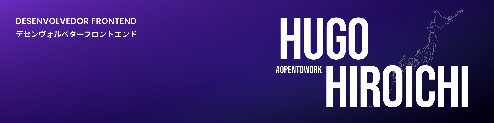

## Konnichiwa, Hiro aqui!
## こんにちは、ひろです！

Você pode entrar em contato comigo por meio das minhas redes:

Sou muito curioso e que gosta de descobrir o funcionamento das coisas, o que me fez buscar mais formas de me desenvolver com cursos na área de programação.

Gosto estudar e ver meu avanço na área de programação! É muito gratificante! Mas, hoje, eu quero desafios maiores para continuar me desenvolvendo.

Estou em busca de oportunidades como desenvolvedor frontend.

Alguns conhecimentos:

Gosto desafios e sempre estou em busca de novas experiências, aprender e compartilhar conhecimentos!
